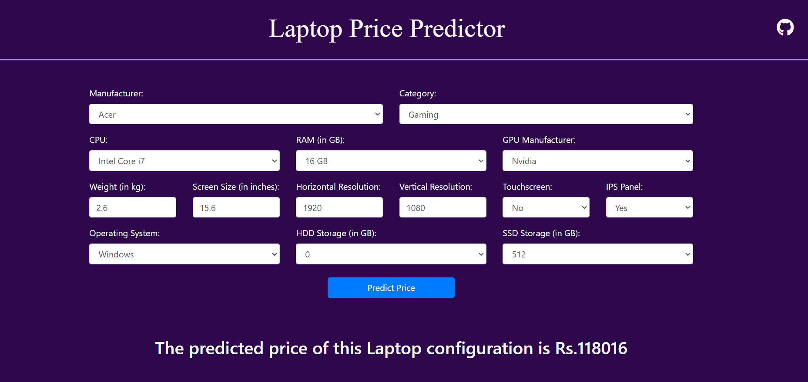

# Laptop Price Prediction

Welcome to the **Laptop Price Prediction** project! This repository contains a machine learning model designed to predict the price of a laptop based on its specifications. Using various regression models, the system estimates laptop prices from key features such as CPU, RAM, GPU, and more.

## Project Overview

This project aims to provide a tool that predicts laptop prices based on user-defined specifications. It uses data from different laptops and applies regression techniques to provide accurate price predictions. The Random Forest Regressor is the model that achieved the best performance, with a Mean Absolute Error (MAE) of **1.25** and an R² score of **0.85**.

The project includes:

- **Exploratory Data Analysis (EDA):** Understanding the distribution of features and their correlation with laptop prices.
- **Feature Engineering:** Transforming specifications like CPU type, RAM size, storage,Screen Resolution, for model input.
- **Model Training:** Training and evaluating regression models such as Linear Regression, Random Forest, and Gradient Boosting.
- **Web Application:** A Flask-based web app where users can input laptop specifications and get price predictions.

## Features

- Predict laptop prices based on input specifications such as:
  - **Brand**
  - **Processor Type**
  - **RAM Size**
  - **Storage Type & Size**
  - **GPU Manufacturer**
  - **Screen Size**
  - **Operating System**
  
- Provides quick and easy-to-use UI through a web app built using **Flask** and **Bootstrap**.
- Offers predictions from the best-performing model (Random Forest Regressor).
  
## Tech Stack

- **Backend:** Flask (Python)
- **Frontend:** HTML, CSS, Bootstrap
- **Machine Learning Models:** Scikit-learn (Random Forest Regressor, Linear Regression, Gradient Boosting)
- **Data Visualization & Analysis:** Pandas, Matplotlib, Seaborn
- **Deployment:** Flask app




## Installation

To run the project locally, follow these steps:

1. Clone the repository:
    ```bash
    git clone https://github.com/ranjeetsohanpal/laptop-price-prediction.git
    cd laptop-price-prediction
    ```

2. Install the required dependencies:
    ```bash
    pip install -r requirements.txt
    ```

3. Run the Flask application:
    ```bash
    python app.py
    ```

4. Open a browser and go to `http://127.0.0.1:5000/` to access the web app.

## Usage

1. Open the web application.
2. Input the laptop specifications like brand, CPU, GPU, RAM, storage type, etc.
3. Submit the form to receive an estimated price for the specified laptop.

## Model Performance

The project explored multiple machine learning models, with **Random Forest Regressor** delivering the best performance:

- **MAE:** 1.25
- **R² Score:** 0.85

## Future Enhancements

- Expand the dataset to include more laptop models and specifications.
- Improve the UI and add more interactive features to the web app.
- Deploy the app on a cloud service for broader accessibility.

## Contributions

Feel free to check the [issues page](https://github.com/ranjeetsohanpal/laptop-price-prediction/issues) if you want to contribute.

## Contact

For any inquiries or suggestions, please contact **Ranjeet Sohanpal** at:
- GitHub: [ranjeetsohanpal](https://github.com/ranjeetsohanpal)
